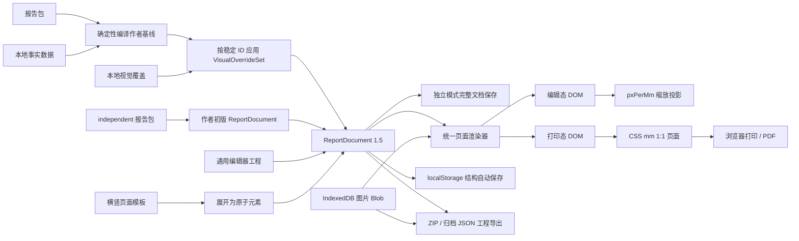
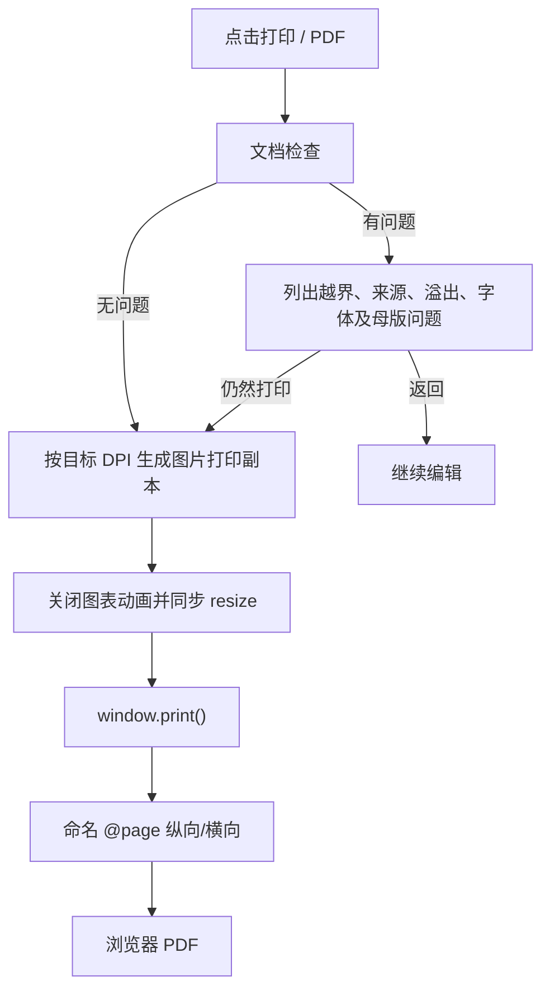

# 架构与文档模型

当前发布候选基线：应用 `1.8.0`，工程格式 `ReportDocument 1.5`。编辑器架构继续使用本文；报告包、编译器、特化运行时和隐私边界见 [报告内核架构](./report-engine-architecture.md)，规范性边界见 [v1.8.0 契约](./contracts-v1.8.0.md)。

## 设计目标

生成器必须同时满足四个条件：

1. 报告数据留在本机。
2. 编辑态与打印态版位一致。
3. 文字和图表在 PDF 中保持清晰。
4. 新增模板或组件时不依赖旧版本补丁覆盖。

因此采用 React + TypeScript + 原生 CSS + ECharts SVG，并用 Vite 生成单 HTML。这里的 React 负责编辑器状态和属性面板，报告页面本身仍是可打印的 DOM。

## 数据流



编辑操作只改 `ReportDocument`。页面缩放、选择框和参考线不是文档内容，不进入 JSON。打印态复用相同元素组件，但不渲染选择框、缩放手柄和网格。

## 两种特化状态

`independent` 报告包直接编译出包含静态 text/chart/table 数据的作者初版。特化 HTML 打开即进入完整编辑器，用户修改后的整个 `ReportDocument` 按报告包 ID 保存；它不经过 `VisualOverrideSet`，也不执行集中字段、公式、规则或绑定。

`bound` 报告包继续使用编译基线与视觉覆盖：

特化报告每次数据变化都从报告包重新编译作者基线，再应用视觉覆盖。`VisualOverrideSet` 使用固定格式和 schema，记录 package id、来源 package version、更新时间，以及按稳定 page/element ID 定位的文档、资产、页面和元素补丁。它保存几何、样式、图层顺序、图片与裁切、图表标签等人工精修；编译后的 DOM 和数组序号都不是覆盖定位依据。

加载视觉存档时先检查 package id。不匹配则忽略并显示提示；package version 变化时允许按稳定 ID 重放并提示用户复核。页面或元素目标消失时累计 `orphanCount`，界面显示 `orphan-override` 后安全忽略，不把补丁套到同名文字或相邻元素。当前 bound 模式只提供这套稳定 ID 重放与孤儿提示，不宣称语义指纹、三方属性合并或自动 ID rename 迁移。

报告包中带 `contentTemplate`、`chartBinding` 或 `tableBinding` 的元素，以及编译器生成的页眉、页脚、页码和尾页制度元素，属于受保护事实。生成视觉覆盖时会剥离这些元素的 `content/runs/chart/table`，使文字、图表和表格事实只能从本地数据、派生公式或报告包修改；静态图表和静态表格仍可在通用编辑器中直接编辑。

本地事实数据和视觉覆盖使用不同的 localStorage 键、状态与重置命令。“恢复示例”只清除本地事实并恢复脱敏 preview；“恢复布局”只删除视觉覆盖并恢复作者基线。任一存储、删除、读取或重校验失败都必须显示告警，不得报告虚假的保存成功。

## 文档模型

核心类型位于 `src/model.ts`：

```ts
interface ReportDocument {
  version: "1.5";
  meta: ReportMeta;
  theme: ThemeTokens;
  pageSetup: {
    grid: number;
    margin: number;
    snap: boolean;
    showGrid: boolean;
    footerMode?: "all" | "confidentiality-last";
    printDpi?: 96 | 150 | 300;
  };
  usedFontSlots: Array<"display" | "body" | "numeric">;
  assets: ReportAsset[];
  pages: ReportPage[];
  updatedAt: string;
}

interface ReportPage {
  id: string;
  name: string;
  section: string;
  master: "cover" | "section" | "standard" | "data" | "blank" | "backcover";
  orientation: "portrait" | "landscape";
  masterProps?: {
    imageAssetId?: string;
    focal?: { x: number; y: number };
    crop?: { sx: number; sy: number; sw: number; sh: number };
    overlay?: "brand" | "darken" | "none";
    overlayStrength?: number;
    imageStyle?: ImageStyle;
    disclaimer?: string;
    contact?: string;
  };
  elements: ReportElement[];
}

interface ReportElement {
  id: string;
  type: ElementType;
  name: string;
  x: number;
  y: number;
  w: number;
  h: number;
  z: number;
  semanticRole?: "title" | "body" | "caption" | "source" | "kpi-label" | "kpi-value" | "kpi-unit" | "kpi-note" | "quote-mark" | "quote-body" | "quote-attribution";
  groupId?: string;
  groupName?: string;
  presetId?: string;
  presetSlot?: string;
  locked?: boolean;
  hidden?: boolean;
  content?: string; // 兼容与检索用纯文本镜像
  runs?: Array<{
    text: string;
    marks?: Array<"bold" | "accentRed" | "accentGreen">;
  }>;
  assetId?: string;
  crop?: { sx: number; sy: number; sw: number; sh: number };
  imageStyle?: ImageStyle;
  chartKind?: "line" | "bar" | "combo" | "donut";
  chart?: ChartData;
  chartLabels?: ChartLabelSettings;
  table?: TableData;
  style: ElementStyle;
}

interface ChartData {
  categories: string[];
  categoryIds?: string[]; // 与 categories 平行的稳定类目 ID
  series: Array<{
    id?: string; // 报告包谱系内保持稳定
    name: string;
    values: number[];
    kind?: "bar" | "line";
    axis?: "left" | "right";
    unit?: string;
  }>;
}

interface ChartLabelSettings {
  mode: "auto" | "all" | "sparse" | "key" | "off";
  sparseEvery: number;
  offsets?: Partial<Record<"portrait" | "landscape", Record<string, { dx: number; dy: number; hidden?: boolean }>>>;
}

interface ReportAsset {
  id: string;
  kind: "image";
  mime: string;
  width: number;
  height: number;
  byteSize: number;
  hash?: string;
  sourceName?: string;
  optimized?: boolean;
  originalRetained?: boolean;
}
```

`x/y/w/h` 始终是毫米。A4 纵向为 210 × 297，横向为 297 × 210。

## 坐标投影

编辑态位置：

```text
screenPx = documentMm × BASE_PX_PER_MM × zoomPercent
```

打印态位置：

```text
cssLength = documentMm + "mm"
```

用户缩放编辑器时不会改写任何元素坐标。打印结果也不依赖当前缩放值。

画布缩放范围为 50%-200%，步进 5%。`Ctrl/Command + 滚轮` 在缩放前把鼠标位置换算为页面 mm 锚点，React 完成布局后再补偿滚动位置。该补偿只属于视口状态；滚动边界和设备像素取整可能产生小于约 1 px 的瞬时抖动，但不会写回元素几何，也不会造成报告坐标累积失真。

## 编辑事务与历史

表单修改使用 `commit(recipe, mergeKey?)`：

1. 深拷贝当前文档。
2. 对副本执行修改。
3. 当前文档进入 past 栈。
4. 清空 future 栈。
5. 写入新文档并更新 `updatedAt`。

连续拖动和缩放不能每个指针帧都产生历史。它们在 pointer down 时保存起始快照，pointer move 只计算预览文档，pointer up 时将起始快照压入 past 栈。历史只保存文档结构，不包含图片二进制。

属性面板中同一元素同一字段的连续输入用 `mergeKey` 合并，500 ms 静默后结束事务。页内编辑不使用可编辑 DOM：多行字段临时叠加原生 `textarea`，KPI 数值、表格单元格、表头与页眉等单行字段使用原生 `input`。普通文本和数字直接显示原生控件文字；只有内容含局部 marks 时，输入文字才透明并叠加调用 `renderRuns()` 的只读 runs 镜像。输入层和镜像层共用字体、字号、行高、内边距、对齐、换行与断词度量样式。

页内编辑使用非受控初值，避免中文输入法组合阶段被 React 重渲染打断。`compositionstart` 到 `compositionend` 期间不重建镜像、不提交，也不响应快捷键；粘贴只读取纯文本。编辑期撤销交给原生输入控件，提交时只把进入会话前的结构快照压入一次全局历史；`Esc` 放弃整个会话。切页、切换纸张方向和打印前都会先提交当前会话。

## 吸附算法

拖动时以当前可移动元素的整体包围盒生成目标 x/y。吸附候选包括：

- 网格倍数。
- 页面左上页边距。
- 页面水平与垂直中心。
- 页面右下页边距减去元素尺寸。
- 其他可见元素的左、右、水平中心、上、下、垂直中心。

吸附阈值按屏幕空间计算：`thresholdMm = 8px / pxPerMm`。因此 50% 到 200% 缩放时，指针手感保持一致。命中后显示红色参考线，按住 Alt 跳过吸附。多选拖动以整个选区包围盒计算吸附和页面边界，再将同一个 delta 应用于全部可移动元素。

显式对齐与拖动吸附是两套命令。单选元素执行六向对齐时以完整页面为基准；多选时以选区包围盒为基准。三项以上可执行水平或垂直等间距分布，首尾元素保持选区边界。每次显式对齐或分布形成一条历史。

## 元素渲染

持久化元素只允许 `text | box | divider | image | chart | table` 六类。标题、来源、KPI 数值等差异由 `semanticRole` 表达，折线、柱状、柱线组合和环形差异由 `chartKind` 表达。KPI、重点结论、带标题图表和带标题表格只是组件库预设：插入后生成多个基础元素，并用一层 `groupId` 维持整体选择、移动、复制、删除、锁定和隐藏；拆组只移除组合元数据，不改内容与几何。

文字持久化为纯文本 runs，不存储 HTML；行内 marks 只允许粗体与语义红/绿。元素级样式只能引用标题体/正文体/数字体字体槽、五档字号（8/10/12/14/28 pt）和主题色。用户行高控件只提供 1.2/1.35/1.5；组合缩放仍不在当前范围内，避免把字体大小和行距按任意比例写回而破坏白名单。

折线、柱状、柱线组合和环形图使用 ECharts 的 SVG renderer。每个图表由 ResizeObserver 跟随元素尺寸。组合图的每个系列可以独立选择柱/线、左/右轴和单位；单元格编辑以稳定列 ID 保留这些设置，重命名系列不会使配置漂移。打印前所有实例同步关闭动画、重设 option 并 resize，等待字体与两个绘制帧完成后才调用 `window.print()`，避免输出动画中间帧。

图表默认规则：

- 最多六个主题色。
- 折线只标最后一个端点，减少碰撞。
- 柱图显示柱顶标签。
- 环形图显示类别和占比。
- 网格线使用主题弱分隔色。
- 标题、图例和坐标统一使用报告字体。

图表系列 ID 与类目 ID 构成单个标签的稳定键，不依赖显示名称或数组序号。标签模式只允许 `auto/all/sparse/key/off`，稀疏步长限制为 2-12。人工拖动产生的 `dx/dy` 以毫米保存，并分别写入 `portrait` 与 `landscape` 分支；横版精修不会污染竖版。旧工程缺失的系列和类目 ID 会在 1.5 迁移时确定性补齐。

## 页面背景与制度元素

左侧模板库是几何生成入口，不是另一套渲染器。5 套封面和 3 套页眉页脚分别实现横竖坐标，应用后写入带 `presetId/presetSlot` 的普通元素。用户随后可以直接移动蒙版、更换图片、改 Logo 和文字、调整规则线；模板应用只进入一次撤销历史。页眉页脚模板只替换制度 role，不删除业务内容。

封面和空白页不自动添加页眉页脚。标准页、数据页和章节页在创建时把以下对象写成普通 `ReportElement`：

- `header-left`：页眉机构。
- `header-right`：页眉章节。
- `header-rule`、`footer-rule`：顶部和底部规则线。
- `footer-left`：密级。
- `footer-page-number`：页码。

尾页的机构、免责声明、联系方式和密级也使用带 `backcover-*` role 的普通元素。它们和业务元素共用选择、图层、几何、对齐、锁定、显隐、历史与打印系统；1 px 规则线仅在编辑态扩大命中区，不改变打印尺寸。`MasterChrome` 组件现在只渲染页面背景图片，不再生成任何不可编辑制度文字。

所有页面类型都可通过 `masterProps.imageAssetId` 引用背景图片。章节页使用约 70 mm 顶部横带，其余页面使用整页槽位；渲染按槽位比例和焦点百分比计算取景，并套用与内容图相同的 `imageStyle`。背景图片不属于 `elements`，因此不进入图层、不参与吸附；但可以双击槽位后直接拖动、滚轮缩放或用裁切手柄调整取景。焦点控件与直接裁切最终都写入 `masterProps.crop`。转换为普通图片元素或把普通图片设为页面背景，都是单次可撤销的文档事务。

内容图与母版图的 `crop` 都使用原图像素坐标 `{ sx, sy, sw, sh }` 保存可见区域。画布、裁切预览和打印副本都由 `ImageVisual` 渲染；调整裁切只改取景参数，不覆盖原始 Blob。图片叠色只保存主题 token、角度、混合模式、强度、调色预设和暗角档位，不把任意 CSS 或裸颜色写入元素。

页面可以逐页选择 A4 纵向或横向。已有元素或母版图片时，属性面板拒绝直接切换方向，避免把原方向几何套到另一张纸；用户需要建立目标方向页面后重新排版。图表标签偏移虽然按方向分开保存，也不等于整页内容可以自动换向。

尾页 `backcover` 另有免责声明、联系方式与密级制度区。`footerMode` 可让密级显示在每页或仅末页；内置 starter 的当前页数只是示例，不构成通用页数约束。

来源行是 `type: "text"` 且 `semanticRole: "source"` 的显式元素。打印检查发现页面有图表或表格但无来源语义文本时会告警，不会偷偷生成无法核对的来源。

## 打印管线



打印媒体中只显示 `.print-stage`。纵向页使用 `reportPortrait`，横向页使用 `reportLandscape`。每页固定尺寸、零外边距、强制打印颜色，并在页末显式分页。

选择浏览器打印而不是 html2canvas + jsPDF，是为了避免把整页文字栅格化。DOM 文字在 PDF 中可搜索，ECharts 的 SVG 也能保持线条清晰。

报告包校验要求至少一页，但内核不设置固定最大页数。实际容量由浏览器内存、图片体积、图表数量与打印环境决定；`finance-brief` 的十页只是该参考包的 PDF 回归值，不是所有报告的页数约束。

图片打印副本按页面设置的 96/150/300 DPI 生成。内容图只保留取景框及四周约 5% 边距，合计约 10% 余量；母版图先按槽位和焦点计算实际可见区。打印后显示处理前后总量、节省比例和体积最大的五个图片副本，原始工程资产不被替换。

## 本地存储与离线构建

自动保存键为 `local-report-studio:document:v1`。`ReportDocument.assets` 保存尺寸、MIME、字节数、SHA-256、来源文件名与优化状态等元数据，页面和元素只保存 `assetId` 引用；图片二进制以 Blob 独立保存在 IndexedDB。这样 `commit()` 深拷贝和撤销历史不复制大图。旧工程缺失的 `byteSize` 会在打开时从 Blob 回填，不进入撤销历史。配额或写入失败会显示持续错误横幅，不会静默丢失。

本地资产仓只接受 PNG、JPEG 和 WebP 的 Blob 或规范 base64 data URL。写入前同时校验资产声明 MIME、Blob/data URL MIME 与实际文件签名，拒绝 SVG、外部 URL、损坏 base64、伪造扩展和签名不符；转换过程不调用 `fetch`、XHR、WebSocket 或远程解码。历史 IndexedDB 记录返回渲染器前执行同一套重校验；失败记录被过滤，不会作为图片交给渲染器，对应资产在界面中显示为缺失。

默认导出 `.report.zip`：根目录为 `document.json`，图片按 `assets/<assetId>.<ext>` 存放。归档用途可导出单 `.report.json`，图片临时编码到顶层 `assetData`，界面明确提示 base64 通常增加约 33% 体积。两种可移植格式都必须包含全部声明图片；导入先限制文件、条目、单项和解压总量，再经 Canvas 重编码剥离 EXIF/GPS、重映射资产 ID，并以单个 IndexedDB 事务落库，全部成功后才切换当前文档。运行态文档不保存 `assetData`，历史快照不会接触图片体；导入失败也不会覆盖当前工程的 Blob。

`normalizeProject()` 是显式迁移入口。目前接受 1.0、1.1、1.2、1.3、1.4 和 1.5。1.3 的 `title/source/kpi/quote`、四种旧图表类型以及表格/图表内嵌标题会确定性展开为基础元素；旧 `value/unit/note` 只作为迁移输入，1.5 导出不再写入。旧 `element.image` Data URL 会拆成资产元数据与数据，任意字号和颜色会归一为白名单或主题 token，1.0-1.2 缺失的制度元素会补齐，旧图表缺失的系列与类目 ID 会确定性补齐。归一化与导出永远写 1.5，`npm run test:migration` 验证展开、ID 补齐与二次导入稳定性。

构建使用：

```text
React + ReactDOM
ECharts SVG
Lucide React
全部应用 CSS
```

上述内容全部内联到 `dist/index.html`。离线检查扫描最终 HTML 的 `src`、`href`、`srcset`、CSS `url()`，以及 TypeScript/CSS 源码字符串中的 HTTP/HTTPS 地址；发现外部运行时资源会退出并报告错误。研究文档中的引用链接不属于运行时扫描范围。

## 扩展点

当前六种基础元素通过 TypeScript 联合类型和组件分支实现，组合能力集中在预设工厂。基础元素或属性面板继续扩展时，应改为注册表：

```ts
interface ElementPlugin {
  type: ElementType;
  label: string;
  create(): ReportElement;
  render(props: RenderProps): ReactNode;
  inspector(props: InspectorProps): ReactNode;
  validate(element: ReportElement): ValidationIssue[];
}
```

母版也可以升级为可注册蓝图，但母版只应管理制度元素与版心，不应偷偷复制业务数据。

## 当前明确未做

- 旋转、把任意多选再次持久化为新组合和自定义标尺。组件预设已有一层 `groupId` 并可拆组，但当前不会把任意多选保存为新的组合对象。
- 自动跨页长表、脚注和孤行寡行控制。
- 视觉覆盖的语义指纹、三方属性合并和自动 ID rename 迁移。
- PPTX、DOCX 或 PDF 字节级导入。
- 网络模板库、远程数据源、多人协作和云端存储。
- 直接连接 Excel 应用；当前只在剪贴板层解析 Excel 复制出的连续单元格区域，用户界面仍是本地单元格网格。

这些不是遗漏的隐藏能力。它们会改变几何、分页或隐私模型，应分别设计和验收。
