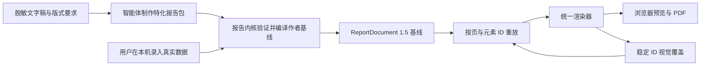

# Report Engine 0.1 架构

当前应用版本：`1.7.0`  
渲染文档格式：`ReportDocument 1.5`  
内核入口：`src/report-engine.ts`

## 1. 产品边界

本项目不继续扩张为本地 PPT。通用编辑器保留为页面渲染、直接编辑和打印底座；报告内核支持两种特化报告包：默认推荐的 `independent` 直接生成一个可完整修改的作者模板，`bound` 才使用集中字段、公式、勾稽和视觉覆盖。智能体制作初版，用户在本机继续编辑。



真实数据不进入智能体或版本库。独立模式只把脱敏示例直接写入各组件，用户修改后的完整文档留在本机；绑定模式仍只嵌入脱敏 preview，真实值由用户在本机录入。两条路径最终都进入同一个 `ReportDocument 1.5` 渲染器。

## 2. 模块职责

| 模块 | 负责 | 不负责 |
| --- | --- | --- |
| 声明式报告包 | independent 的直接元素数据，或 bound 的字段、派生、规则与绑定；页面、主题、资产 | 任意代码执行、远程取数、真实数据持久化 |
| 报告内核 | 类型与结构验证、安全表达式、绑定、原子化编译、脱敏预览 | 业务口径猜测、自由 DOM 编辑、打印渲染 |
| 通用编辑器 | `ReportDocument 1.5` 渲染、图表、图片、页面、视觉精修、打印 | 报告领域公式、字段录入流程 |
| 视觉覆盖层 | 按稳定页/元素 ID 保存和重放视觉差异、报告孤儿覆盖 | 业务事实合并、语义猜测、自动重命名迁移 |
| 特化运行时 | independent 的完整文档编辑与保存；bound 的字段表单、数据迁移和视觉覆盖；打印质量提示 | 云同步、账号、网络、遥测 |
| CLI | validate、preview、compile、build 的确定性调用 | 交互式业务判断 |

## 3. 报告包契约

`independent` 报告包只声明页面、直接元素、主题和资产。它禁止 `dataSchemaVersion`、fields、derived、rules、inputSections、dataMigrations 以及三类绑定。每个图表和表格直接持有自己的数据，组件之间没有自动关系。

`bound` 报告包使用以下层次；未声明 authoringMode 的旧包仍按 bound 解释：

报告包使用以下层次：

1. `fields` 声明用户输入事实及类型、单位、敏感性和 preview。
2. `derived` 使用受限表达式 AST 计算当前值、同比、结构占比和勾稽中间值。
3. `rules` 对公式结果执行 error 或 warning 级检查，并用稳定 locator 指向页面或元素。
4. `pages` 以毫米坐标组织作者宏和原子元素。
5. `assets + assetData` 以资产 ID 绑定本地位图元数据和 data URL。

KPI 和引语是作者宏，不是文档元素类型。KPI 编译为 box 加四个 text；引语编译为 box 加三个 text。图表和表格保留为基础元素，因为它们拥有结构化数据和独立渲染器。

## 4. 数据所有权

独立模式的事实所有权属于每个 text/chart/table 元素。编辑图 A 不会重算或修改图 B；修改表格不会改变相邻图表。组件旁“编辑数据”直接更新当前元素，完整文档作为本机事实源。

绑定模式继续使用单一事实源：

同一个事实只能在 `fields` 中录入一次。图表、KPI 和表格必须绑定同一字段或派生值。财务参考包的收入、贸易区、成本和费用表均使用 column bindings 从标签、数值和公式生成，已删除手工维护的展示行。

编译器先从源数据中选择声明字段，再计算派生值。未声明字段被丢弃，源数据中伪造的派生路径不会覆盖公式结果。

## 5. 作者基线与视觉覆盖

报告包和本地数据共同生成作者基线；视觉覆盖只记录基线与用户精修结果的差异。运行时按稳定 page ID 和 element ID 重放覆盖，再把合成后的 `ReportDocument 1.5` 交给统一渲染器。

边界按元素的数据来源划分：

- 带 `contentTemplate`、`chartBinding`、`tableBinding` 或内核角色的元素属于受保护元素。布局精修侧栏不开放事实编辑，也不允许删除或复制；保存覆盖和读取旧覆盖时都剥离 `content`、`runs`、`chart`、`table`、删除标记和事实型副本，因此数据刷新或旧存档重放后仍以新编译事实为准；位置、尺寸、层级、样式和标签设置等视觉调整可以保留。
- `document.meta` 由本地数据和报告包拥有，不能进入视觉覆盖。特化精修的报告信息只读，避免当前打印和后续重放冻结旧机构、期间或密级。
- 不带绑定的既有静态元素由作者或用户直接负责，可把文字、图表或表格内容作为视觉覆盖的一部分保存。特化精修新增覆盖对象只允许 box/divider/image，并剥离全部事实字段；需要增加 text、chart、table 时更新报告包作者基线。
- 页面或元素 ID 在新基线中消失时，对应覆盖计为孤儿，运行时发出 warning 并安全忽略，不让旧差异破坏新文档。

数据存档和视觉覆盖使用不同的本地存储键与重置动作。“恢复示例”只清除录入数据并保留视觉精修；“恢复布局”只清除视觉覆盖并保留当前数据。

当前 bound 重放能力严格依赖稳定 ID，**没有**语义指纹、三方合并或 ID 自动重命名迁移；报告包升级时若改动 ID，作者必须主动处理孤儿告警。独立模式不重放视觉覆盖，而是保存完整文档。

## 6. 安全表达式

表达式是 JSON AST，只允许白名单操作，包括算术、同比、数组合计、序列运算、结构占比和布尔断言。引用必须精确命中已声明字段或派生值，禁止 `eval`、`Function` 和字符串代码。

派生字段使用依赖解析器和缓存。循环依赖、未知操作、未知路径、零分母和序列长度不一致均进入结构化 `EngineIssue`。

## 7. Fail-closed 编译

包级错误包括非法主题、字号、页面方向、几何、重复 ID、未知绑定、错误表达式、缺失资产和无效表格/图表定义。只要存在包级 error，编译器返回使用安全主题的空文档，不生成部分页面。

数据级错误仍生成可预览文档，但 PDF 按钮保持禁用，方便用户根据 locator 修正输入。运行时不会把异常吞成空白页面。

## 8. 图片、图表与方向

图表序列和分类应提供稳定 ID。标签偏移以毫米记录，并分别存入 `portrait` 与 `landscape` 命名空间，避免横版微调污染竖版布局；页面已有内容或母版图时不能直接切换方向，应新建目标方向页面后重新排版。

内容图片与母版图片都保留原始资产，裁切只写原图像素坐标。两类图片都可以在画布中直接进入非破坏性裁切，不需要先把母版图片转换成自由元素。

本地资产、工程导入和报告包内嵌资产统一只接受 PNG、JPEG 和 WebP，并校验 MIME、规范 base64 和文件签名。可移植工程在完整解码前解析图片尺寸头，最多导入 256 张图片，单图不超过 64 MP，合计不超过 256 MP；超过 4096 px 的图片缩小后，内容图和母版图的裁切框按新旧宽高分别缩放，避免焦点漂移。写入和读取历史 IndexedDB 记录时执行相同校验，且特化运行时使用报告包命名空间保存资产；两个报告即使都使用 `logo`，也不能跨包串图。损坏、伪装或不匹配的记录不会作为图片源返回，资产路径不使用 `fetch`。工程主题同时限制为十六进制色值和无 URL 字体栈。

## 9. 隐私与离线

- `createPreviewData()` 从空对象开始，只复制声明字段，并替换所有敏感值。
- `build` 总是嵌入 preview，不直接嵌入命令输入中的敏感字段。
- 特化 HTML 使用 CSP：默认拒绝全部资源，脚本和样式只允许内联，图片只允许 data/blob，连接明确为 none。
- 浏览器存储失败显示持续警告；导入文件必须匹配 package id 和 version。
- 运行时无 CDN、上传、登录、遥测和网络请求。

作者可以在项目 `report-packages/` 中使用 `.mjs` 辅助函数展开重复版式，但这是 Node 代码执行边界，不是声明式内核的一部分。CLI 默认只读取 JSON；只有已经审阅的本地作者源码才能显式使用 `--trusted-code`，并且路径必须留在 `report-packages/`。内核验证未知根属性和未声明资产数据为 error，`preview` 与 `build` 还会重新编译脱敏数据，避免把私有附加属性或结构损坏的预览写入交付 HTML。

## 10. 调用面

```bash
npm run engine:validate
npm run engine:compile
npm run engine:build
npm run engine:pdf
npm run engine:inspect-pdf
```

可复用 Skill 入口为 `.agents/skills/cosco-report/scripts/report-engine.mjs`，它把参数原样传给可重复调用的 CLI。报告包必须声明稳定的 `documentUpdatedAt`，因此相同包和数据的 `ReportDocument` 字节内容保持一致；打印器也把 PDF 的创建与修改时间规范化为该值，再以最终产物哈希执行发布校验。PDF 检查器从同轮编译文档读取页数和逐页方向，验证每页 A4 尺寸并在 `inspection.json` 记录期望/实际方向。

## 11. 扩展规则

新增报告优先新增 `report-packages/<id>/`，不得复制内核。只有多个报告包都需要且语义一致的能力才进入内核。领域公式、阈值、页面叙事和录入分区留在报告包；通用类型、表达式、验证、资产和编译能力留在内核。

报告包至少包含一页，但内核不设置固定最大页数。实际可承载页数受浏览器内存、图片体积、字体和打印环境约束；参考财务简报的 10 页是该报告包的验收值，不是通用容量承诺。

连续长文、自动分页、脚注、跨页表格属于流式出版引擎，不应塞入当前固定页内核。需要时可另建流式编译出口，继续复用字段、公式、规则和隐私层。
